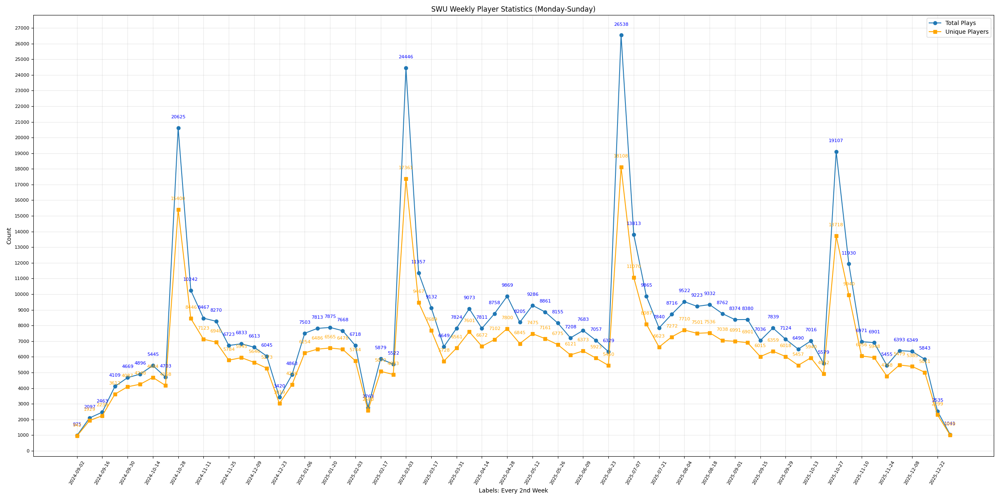
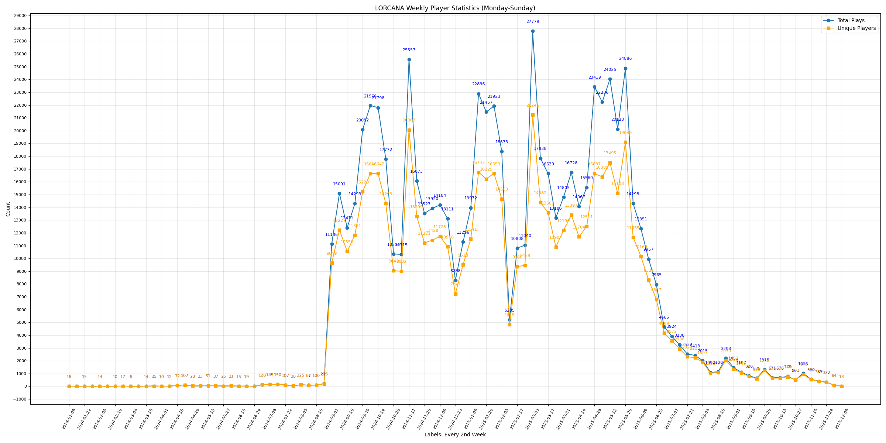

# melee.gg-scraper
Scraper for the Melee.gg website for the TCGs: Star Wars Unlimited and Lorcana.
This repo also contains what I've already scraped and the generated charts from the data.
  

# About the Files
Each of the games' folders contains the following:
- `events.csv` columns: `DATE,EVENT_URL,ORGANIZER,PLAYER_COUNT`
- `players.csv` columns: `PLAYER_NAME,DATE,EVENT_URLS`
- `<game>_<daily/weekly/monthly>_players_<date>.png` (these charts are based on `players.csv`)
    - Daily charts
    - Weekly charts
    - Monthly charts
- `checked_urls.txt`: used by the code, should basically be the EVENT_URL column from `events.csv`
- `log.txt`: a log of events where the date couldn't be processed/ambiguous

`main.py`: the scraper and saves the scraped data to the csv files. 
`plot_players_<daily/weekly/monthly>.py`: generates the charts.
  

# Showcasing the Weekly Charts
General Stats:
- Star Wars Unlimited:
    - Events*: 57864
    - Players: 58683
    - Participation: 533059
- Lorcana:
    - Events*: 85762
    - Players: 81450
    - Participation: 728154
    
*Ignores any events with ambigious dates and ignores events outside the set time range.
  

Things to be aware of:
- Star Wars Unlimited: 
    - The game was released in 2024/03.
    - Melee partnership started in 2024/09.
- Lorcana: 
    - The game was released in 2023/08.
    - Melee partnership started around 2024/08(?) and ended around 2025/07(?).
  

Explanation of the Legend:
- Total Plays: the number of total plays based on a daily/weekly/monthly basis, depending on the given chart. 
    - For example, if John Doe plays 3 times a week, they would count as three in that given week in the weekly chart.
- Unique Players: the number of unique players based on a daily/weekly/monthly basis, depending on the given chart.
    - For example, if John Doe plays 3 times a week, they would only be counted as one for that given week in the weekly chart.
  

Star Wars Unlimited's Data:
- Scraped on 2026/01/02
- Only scraped starting from 2024/08 and onward.

Lorcana's Data:
- Scraped on 2025/12/04
- Minor bug: the scraper shouldn't have scraped before 2024/08, oh well.

  

## My Star Wars Unlimited Socials:
- https://www.LumiMouse.com
- https://www.youtube.com/@LumiMouseTCG